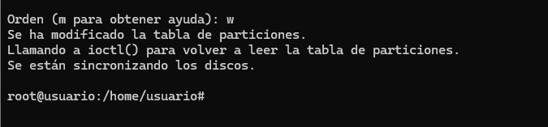

# Particionado

Primero añadiremos los discos necesarios para la práctica, en este caso uno de 50GB para particionar en GPT y uno de 100GB para particionar en MBR.

## Verificación de los discos

Comprobamos que los discos se añadieron adecuadamente y comprobamos el estado de partida.

## Particionado con Gdisk

Empezamos por el disco más pequeño que particionaremos con **Gdisk**.

### Creación de particiones

A continuación, haremos las particiones.

Guardamos y salimos.

### Formateo y montaje

Formateamos en **ext4**.

Montaje en `/media/sdb`.

Añadimos los ficheros de texto.

### Configuración del `fstab`

Configuramos el `fstab`.

Aplicamos los cambios.

---

## Particionado con fdisk

A continuación, el disco de 100GB con la herramienta **fdisk** e iremos creando las distintas particiones primarias.

### Creación de particiones

Ahora la extendida.

Ahora haremos las lógicas, siguiendo el mismo proceso con las dos.

Guardamos con `W`.

### Formateo y montaje

Formateamos las particiones, repitiendo el proceso con cada número de partición.

Montamos las particiones.

Añadimos el fichero de texto correspondiente a cada partición.

Editamos el fichero `fstab`.

---

Y con esto estaría completa la práctica.
